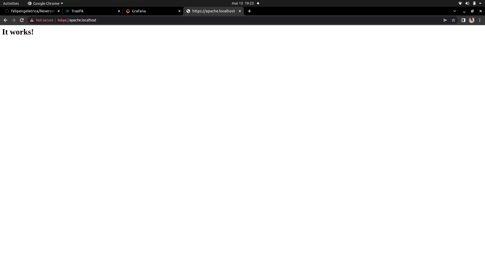

# Redes-Computadores2022-2

# Projeto PROXY reverso 

 Utliliza o Traefik para servidor Apache, Grafana e monitoramento utilizando o dashboard próprio do Traefik.
    
Este projeto utiliza Docker facilitando a implantação (deploy) dos serviços. 
 ***

 ## Implantação dos serviços
 Abrir o terminal e execute os seguintes comandos:

Construindo e excutando os serviços (pressione ctrl+c para cencelar):

 > $ docker-compose up --build

 Utilize -d para dar um "detach" rodar o serviço na máquina

> $ docker-compose up --build -d

Parando serviços: 
> $ docker-compose stop

Removendo serviços: 
> $ docker-compose rm
***

## Usando Postgres
Para usar o Postgress precisamos criar ela na docker-compose.

OBS:caso não rode devido a versão do postgres, procure a versão mais estavel. Evite a ultima "latest" versão.

O database do postgres não consegue ser visualizado pelo navegador, então vamos instalar o Dbeaver.
Caso você utilize Windows simplismente baixe o instalador e execute.
Se utulizar o Linux(Ubuntu) execute o comando no terminal: $ sudo snap install dbeaver-ce para instalar o Dbeaver.

A IDE que eu utilizei é Visual Studio code, testei e funciona tambem com o InteliJ, Ja outras IDE's é por sua conta.

No VScode ou InteliJ instale a extensão do docker.

É muito provável que você não consiga rodar os comandos abaixo, antes disso você deve rodar o seguinte comando:

docker network create "web"
Esse comando se faz necessário, pois o docker-compose está configurado para a rede "web".

Tambem instale WLS2 "Ubuntu for Windows", pois usaremos dois comandos para fazer o middleware de autenticação.

Execute o seguinte comando para você conseguir "construir" o container com as imagens, podendo assim executar os serviços via docker. Pressione ctrl+c para cancelar o processo ou parar o container:

$ docker-compose up --build

Caso queira parar todos serviços Utulize:
$ docker compose stop

Abra o docker Desktop deve haver conteiner um conteiner criado.

Caso não Revise seus passos.

agora abra o Dbeaver a interface é mais ou menos assim:

Clique no icone de tomada("conectar").

Nisso deve abrir uma tela, selecione o postgres.

Depois deve abrir a seguinte tela:

Verifique se as informações estão corretas, especialmente a porta do postgres.
 
 Se tudo deu certo deve aparecer um database:
 

 E pronto! Você esta rodando o postgres com conteiner docker e exibindo ele no Dbeaver.

 ## Middleware de auteticação

 Agora vamos para a autenticação.

 abra o Ubunto for Windows.
 Rode o seguinte comando para instalar o apache 2 no terminal

sudo apt install apache2-utils

Agora execute o seguinte comando no mesmo terminal que rodou o comando acima, mas altere daniel pelo nome do seu usuário.

htpasswd -nB leonardo (Use o seu nome)

Ele irá gerar para o seu usuário uma senha como gerou para o meu
"$$2y$$05$$kJfb8phLRJI0grAHzVDdq.3oYkv3kTIsT.2Aosnd8vLp2z1OKPAxm"

agora coloque isso no traefik:
 

Na parte do nome troque pelo seu

Em todos os locais que ha um "$", coloque mais uma cifrão no lado.
Feito isso pare o conteiner e depois inicie denovo e tente acessar o traefik.
Ele ira pedir um usuario (o seu nome).
E a senha que é a Palavra que você escolheu e nao a senha.

 ## Testando os serviços

Utilize o navegador web e digite a seguinte url:

> http://apache.localhost

  

 > http://grafana.localhost

  

  > http://dashboard.localhost

  
